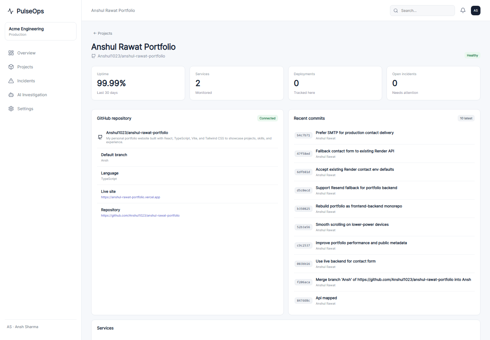

# AI Reliability Platform




A production-oriented monorepo for monitoring GitHub-backed applications, detecting incidents,
using Redis for caching/rate limiting/locks/PubSub/queues, and running AI-assisted incident analysis.

## Stack

- Dashboard: React + Vite + Recharts
- API: FastAPI + Pydantic + SQLAlchemy
- Database: PostgreSQL (Supabase-compatible)
- Redis: cache, rate limiting, locks, Pub/Sub, job queue
- Workers: Python asyncio workers
- AI: provider abstraction with deterministic demo mode; optional OpenAI-compatible provider
- GitHub: REST API abstraction; demo mode works without credentials
- Realtime: FastAPI WebSocket + Redis Pub/Sub
- Infrastructure: Docker Compose + Nginx + Prometheus

## Quick start

### Docker

```bash
cp .env.example .env
docker compose up --build
```

Dashboard: http://localhost:5173
API docs: http://localhost:8000/docs
Prometheus: http://localhost:9090

### Local API

```bash
cd apps/api
python -m venv .venv
# Windows: .venv\Scripts\activate
# macOS/Linux: source .venv/bin/activate
pip install -r requirements.txt
uvicorn app.main:app --reload --port 8000
```

### Local dashboard

```bash
cd apps/dashboard
npm install
npm run dev
```

## Demo mode

The application starts in demo mode unless credentials are supplied. Demo data is stored in
PostgreSQL and the GitHub/AI integrations return safe deterministic sample data.

## Environment

See `.env.example`. Never commit production secrets.

## Architecture

```text
React Dashboard
      |
      | REST / WebSocket
      v
   FastAPI
   /  |  \
  DB Redis GitHub
      |
  cache / rate-limit / lock / queue / PubSub
      |
   Workers
      |
  AI investigation
      |
   PostgreSQL
```

## Redis responsibilities

- `cache.py`: short-lived response caching
- `rate_limiter.py`: per-client request limiting
- `locks.py`: prevents duplicate incident investigations
- `pubsub.py`: live incident updates
- `queues.py`: durable-ish Redis-backed demo job queue
- `client.py`: shared Redis connection

For a larger deployment, replace the simple Redis list queue with Redis Streams or a dedicated
task system such as Celery/RQ/Arq.

## AI chat (RAG)

The dashboard's **AI Chat** page answers questions about any project, grounded in live
context: repository metadata, README, file tree, monitored services, and recent incidents
(`POST /ai/chat`). It works out of the box in demo mode (deterministic answers from real
data, no key needed). For real LLM answers set an OpenAI-compatible provider:

```env
AI_PROVIDER=openai
OPENAI_API_KEY=<your key>
AI_MODEL=llama-3.3-70b-versatile
AI_BASE_URL=https://api.groq.com/openai/v1   # Groq free tier; see .env.example for others
```

## Making changes from the dashboard

The chat page can browse any repo's files and propose changes. Changes are committed to a
new branch and opened as a **pull request** — the platform never pushes to `main` directly.
This requires `GITHUB_TOKEN` with `repo` scope.

## Auto-sync

New GitHub repos appear in the dashboard automatically: the worker syncs on startup and
every 6 hours (`POST /projects/sync` triggers it manually). With `GITHUB_TOKEN` set, private
repos are included; otherwise the public repos of `GITHUB_OWNER` are used.

## Security notes

The included GitHub and AI integrations are intentionally read-only/demo by default.
Production action execution should require authentication, authorization, audit logging and
explicit human approval. Write endpoints are protected by the `API_KEY` (see below).

### API authentication

Write endpoints (`POST /incidents/{id}/investigate`, `POST /ai/analyze/{id}`) are protected by an
API key when `API_KEY` is set in the environment. Send it as `Authorization: Bearer <key>` or
`X-API-Key: <key>`. Read endpoints stay public (the dashboard is a status page).

`API_KEY` is empty by default (auth disabled for local development) — **set it for any public
deployment**. Store the key in the dashboard's Settings → API access, which keeps it in the
browser's localStorage rather than the shipped bundle.
